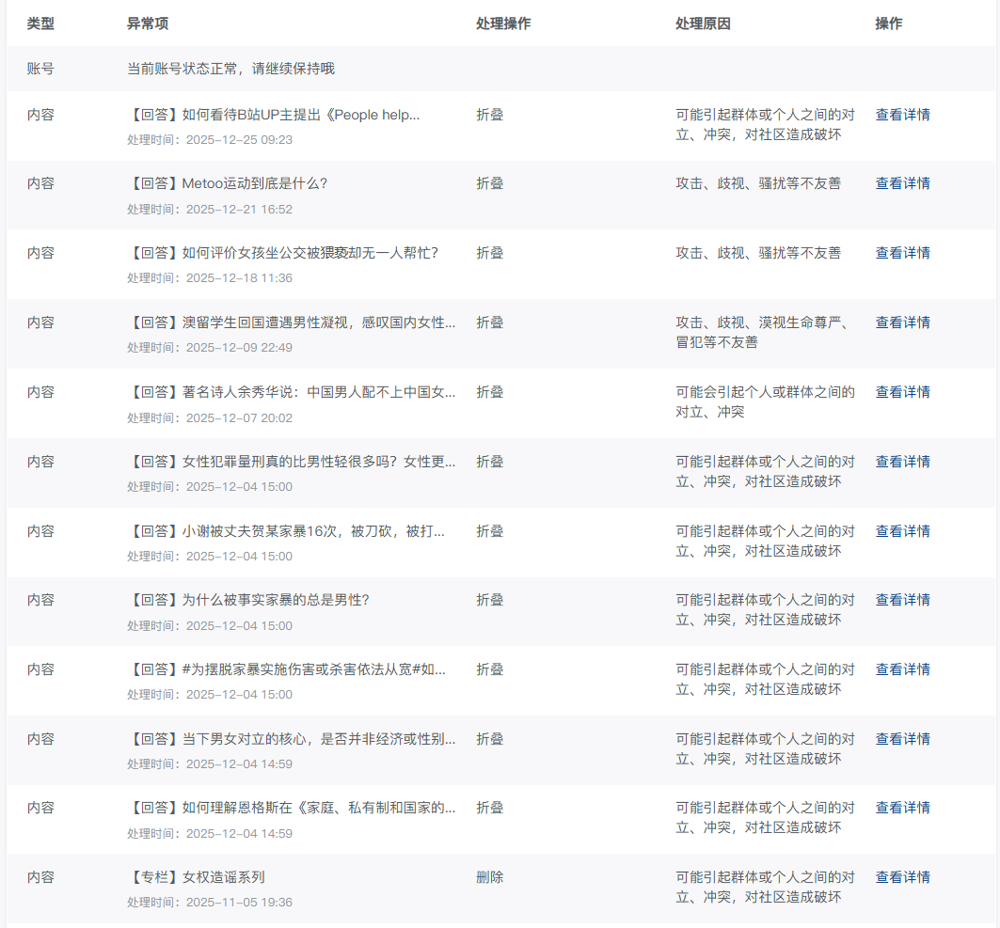
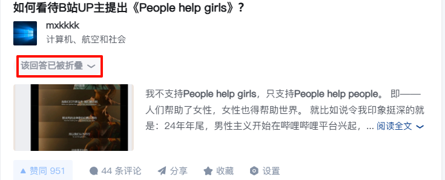
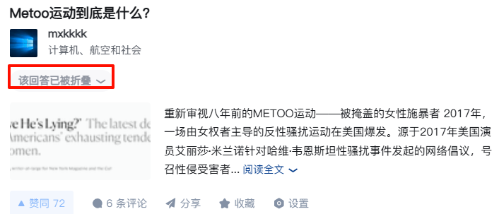
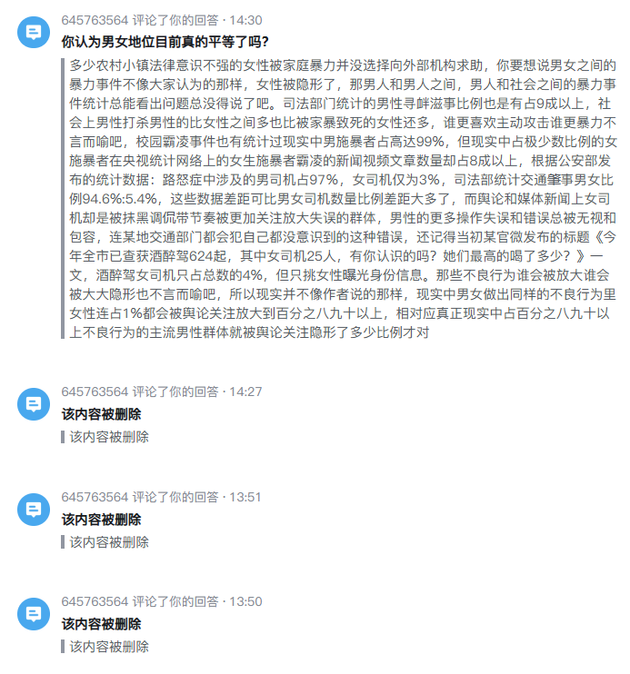
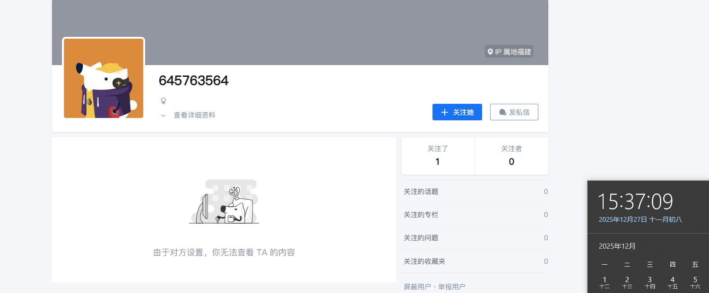
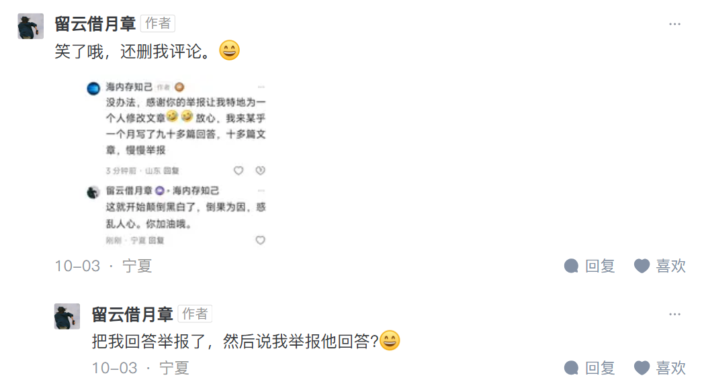
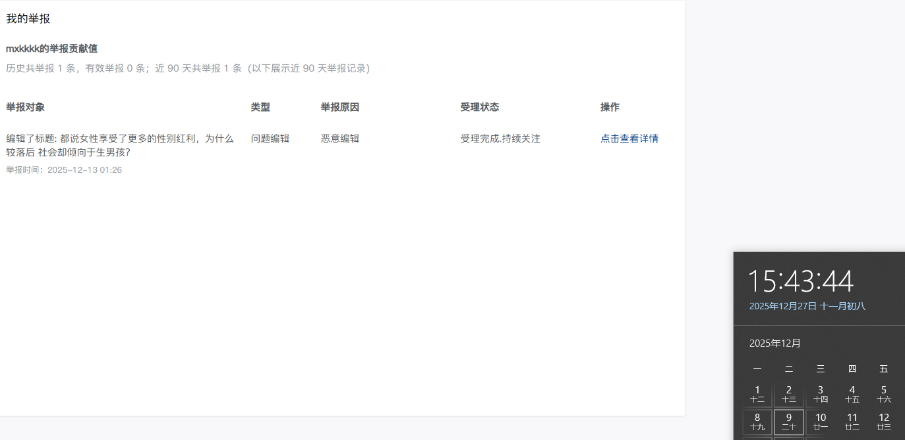
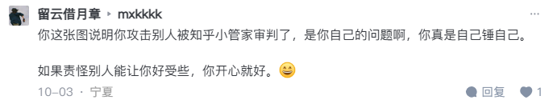

大家好，我是[mxkkkk](https://www.zhihu.com/people/mxkkkkfem)。

我自2025年12月4日以来遭到了知乎数据女工的大规模恶意举报，导致我的11篇回答遭到折叠。

为了防止账号被永封那一刻来的过早，我决定**停更**。从2025年12月27日一直到2026年1月27日。

在这段时间我还会发评论和想法，但文章不再更新。

谁举报的我也大概猜出来了——知乎用户[645763564](https://www.zhihu.com/people/645763564)

因为她在同一天还在我的回答下玩了几个一击脱离，此后正巧是在此时，我的回答被大规模恶意举报，基本很难是别人。

再这里，我也想提一嘴我之前被国女污蔑的经历

**我从来不会删除任何人的评论**

就比如说这位[留云借月章](https://www.zhihu.com/people/6586-66)

这个是我的举报记录，截图时间是2025年12月27日，也就是说能追溯至2025年9月27日以前的记录，大家可以看看我到底有没有举报她的回答？！

语言腐败玩的也是贼六，她的回答被删是因为有人急了，但我的回答被删就是我不友善，我请问语言腐败是国女的本性还是什么？

